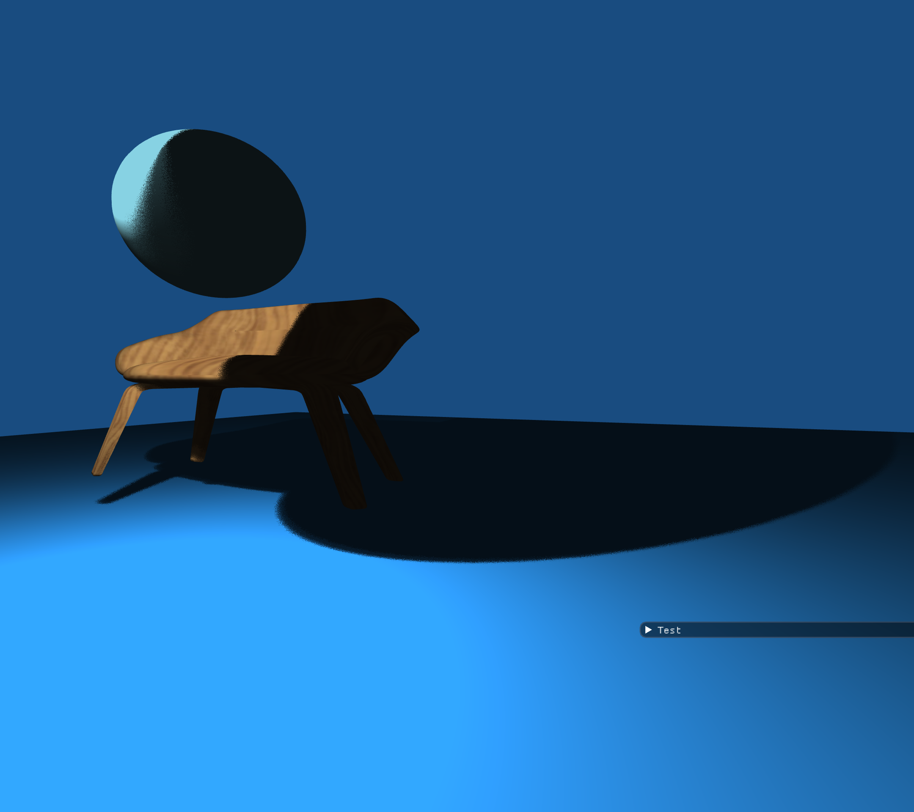
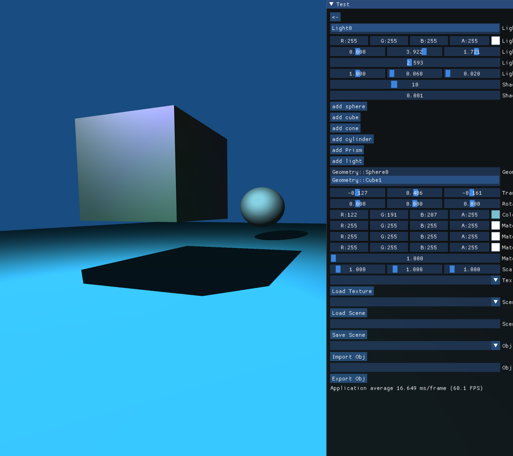
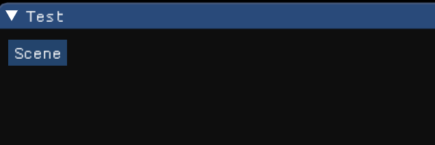
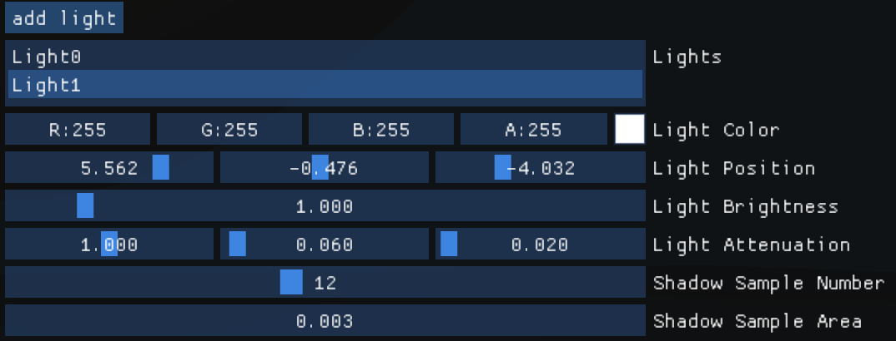
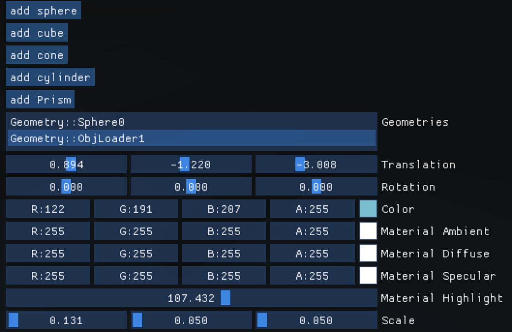
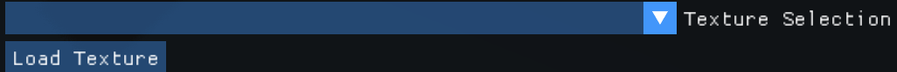
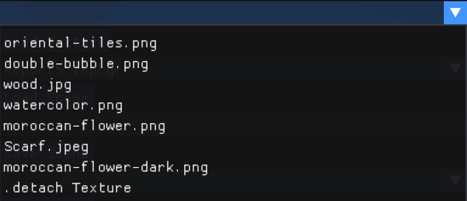
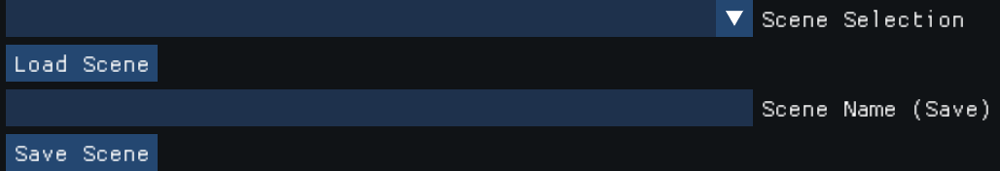
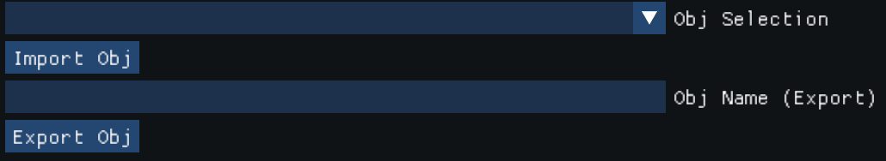

# OpenGL-Renderer-Project
####实现功能

* 基本体素（立方体、球、圆柱、圆锥、多面棱柱、多面棱台）的建模表达能力
* Obj文件的导出和导出
* 基本材质、纹理的显示和编辑能力
* 基本几何变换功能（旋转、平移、缩放等）
* Blinn-Phong光照模型，对点光源的编辑（位置、衰减度、亮度、添加、删除等等）
* 阴影映射，基于Poisson Map随机采样点的PCF软阴影模型
* 相机的漫游，FPS模式的镜头移动
* 多种相机观察模式，相机的Zoom In/Out，Zoom to Fit以及Orbit观察模式
* 屏幕截图保存

####渲染图示例

#### 快捷键说明

|        快捷键         |                 功能                 |
| :-------------------: | :----------------------------------: |
|      W、S、A、D       |           相机前后左右移动           |
|    Space（空格键）    |  进入/退出相机的FPS模式（漫游模式）  |
|       Shift + O       |          进入/退出Orbit模式          |
| 双指在触摸板上滑/下滑 |          Zoom In / Zoom Out          |
| 双指在触摸板左滑/右滑 |   Orbit模式下相机在圆周上左右转动    |
|       鼠标移动        |       FPS模式下相机镜头的移动        |
|          TAB          |          恢复默认的Zoom状态          |
|       Shift + A       | 导出截图，路径在`Export/Screenshots` |
|       Backspace       |           删除选中几何物体           |
|   Shift + Backspace   |             删除选中光源             |

#### 图形界面说明

进入界面后，首先选择Scene进入主场景

#### 光源/阴影区

`add light`：添加光源，在下面的列表中可以选择当前选中的光源。至多支持三个光源。

`Light Color`：光源颜色。

`Light Position`：光源在世界坐标系下坐标。

`Light Brightness`：光源亮度。

`Light Attenuation`：光源的衰减系数。

`Shadow Sample Number`：阴影采样点数目，样本点越多，阴影边缘软化的效果越好，但是计算负担也更大。

`Shadow Sample Area`：PCF阴影映射采样的面积范围。

#### 几何区

`add sphere / cube / cone / cylinder / prism`：添加几何物体，默认位置都在相机的正前方。在`Geometries`列表中可以选择选中的几何物体。

`Translation`：几何物体的位置。

`Rotation`：几何物体关于三个轴的旋转角度。

`Color`：物体的颜色。

`Material`：物体的材质；Ambient、Diffuse、Specular分别指物体对环境光、满射光、反射光的响应颜色，Highlight表示物体的反光度。

`Scale`：物体的缩放程度。

#### 纹理区

选中图片，为当前选中物体添加纹理。图片大小和格式不限，但是需要放在目录`resource/Textures`下面。其中`.detach Texture`指的是删除当前物体的纹理。

#### Scene区

场景的保存和加载。场景文件的后缀是`.zephyr`，都放在目录`Export/Scenes`下面（保存时文件名字不必写后缀）。

#### Obj区

导入的obj模型放在路径`resource/Obj`下，导入以后就可以当作普通的几何物体在几何区中进行操作。

`Export Obj`：将当前选中的几何物体导出为Obj文件，放在路径`Export/Objects`下（文件名字不必写后缀）。
